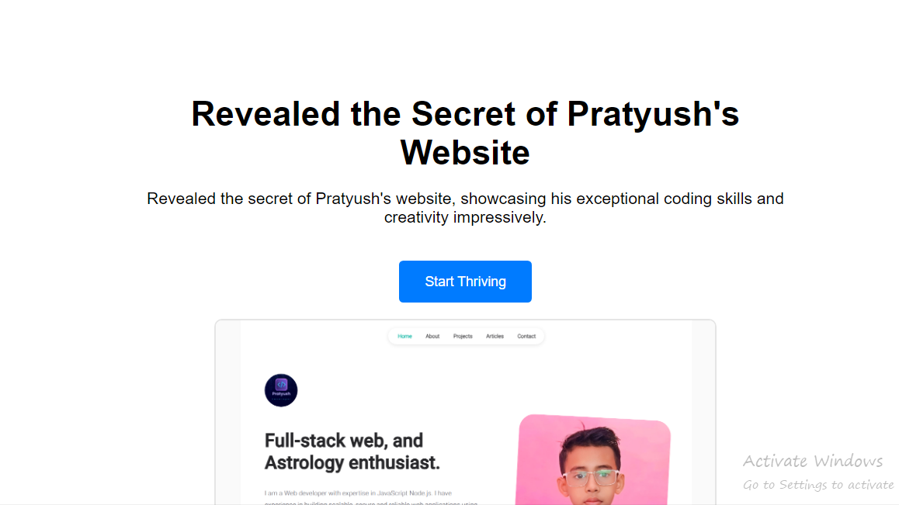

# Premium White Space

<div class="center" align="center">
  
</div>

**Premium White Space** is a sample UI built using React and Vite, inspired by the "Premium White Space" web design trend. It serves as a clean and minimalistic template commonly used across several modern websites.

## Overview

This project demonstrates the "Premium White Space" design trend, which emphasizes simplicity, clarity, and effective use of empty space to enhance content visibility and user experience. This design is part of the broader web design trends, including flat design, smart video, dynamic scrolling, and more.

## Web Design Trends Reference

The "Premium White Space" design is one of many current trends in web design, including:

- Flat is in
- **Premium white space** (used in this project)
- Web design in motion
- Smart video
- Color theory redux
- Asymmetric layouts
- Responsive and adaptive design
- Accessibility
- Chatbots
- Interactivity
- Dynamic scrolling
- Evolution of SEO
- Dark mode
- Original illustrations
- Data visualization
- Pseudo-3D
- Hamburger menus revisited
- Split-screen layout
- Full-screen forms
- Privacy and data collection

**_source_**: https://financesonline.com/web-design-trends/

For more details on these trends, check out [Web Design Trends](https://financesonline.com/web-design-trends/).

## Features

- **Modern UI with Premium White Space**: A clean, minimalistic layout that enhances content focus and readability.
- **Non-scrollable Layout**: Designed to keep all essential elements visible without scrolling.
- **React + Vite**: Built using modern technologies to ensure a fast and responsive experience.
- **Responsive Design**: Fully responsive, optimized for various screen sizes.

## Technologies Used

- **React**: For building dynamic user interfaces.
- **Vite**: For a fast development experience and optimized builds.
- **CSS**: To style and create the premium white space layout.

## Getting Started

To run this project locally, follow these steps:

### Prerequisites

- [Node.js](https://nodejs.org/en/) (v14 or later)
- npm (Node Package Manager)

### Installation

1. **Clone the Repository:**
    ```sh
    git clone https://github.com/pratyush0898/premium-white-space.git
    cd premium-white-space
    ```

2. **Install Dependencies:**
    ```sh
    npm install
    ```

3. **Run the Development Server:**
    ```sh
    npm run dev
    ```

4. **Open the App:**
   Open [http://localhost:3000](http://localhost:3000) in your web browser to view the app.

## Usage

This project is a template for websites following the "Premium White Space" design trend. It can serve as inspiration for creating clean, effective, and visually appealing websites.

## Contributing

Contributions, issues, and feature requests are welcome!
